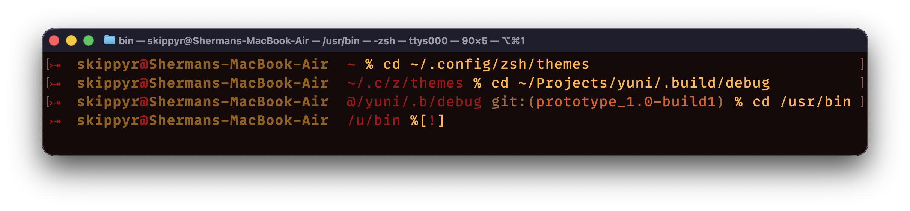
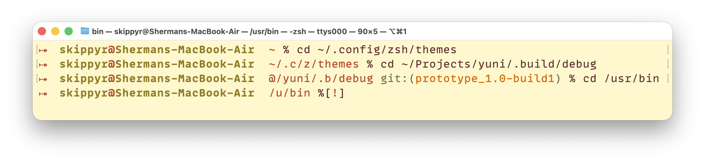
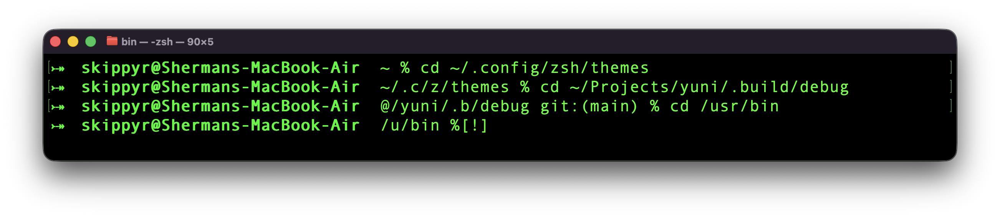

# yuni
## About
A modern version of the macOS default ZSH theme, adding features developers have been missing for a long time. It's available for macOS 14 Sonoma or later.





It shows:
- The exit code of failed commands.
- The active Python virtual environment.
- Your user and host names.
- The current directory path, abbreviating parent directories and shorting it inside of repositories.
- The active Git branch or rebase hash.
- Privilege decorators:
  - `%` if you're a normal user or `#`, if root.
  - `[!]` when you don't have permissions to write to the current directory.

Disable the colors of the prompt by setting the environment variable `NO_COLOR` to a non-empty string value.

## Install
### Using OhMyZSH Framework
- Download the latest release from the [Releases page](http://github.com/skippyr/yuni/releases/latest).
- Extract the archive.
- Move the extracted directory to `~/.oh-my-zsh/custom/themes`, renaming it to just `yuni`.
- Set it as your theme in your `~/.zshrc` file:

```zsh
ZSH_THEME='yuni/yuni'
```

- Reopen the shell.

### Without Using a Framework
- Download the latest release from the [Releases page](http://github.com/skippyr/yuni/releases/latest).
- Extract the archive.
- Move the extracted directory to `~/.config/zsh/themes`, renaming it to just `yuni`.
- Add this to your `~/.zshrc` file:

```zsh
source ~/.config/zsh/themes/yuni/yuni.zsh-theme
```

- Reopen the shell.

## Help
If you need help related to this project, open a new issue in its [issues pages](https://github.com/skippyr/yuni/issues) or send an [e-mail](mailto:skippyr.developer@icloud.com) describing what is going on.

## Contributing
This project is open to review and possibly accept contributions in the form of bug reports and suggestions. If you are interested, send your contribution to its [pull requests page](https://github.com/skippyr/yuni/pulls) or via [e-mail](mailto:skippyr.developer@icloud.com).

## Copyright
This software is licensed under the MIT License. Refer to the `LICENSE` file that comes in its source code for more details.
